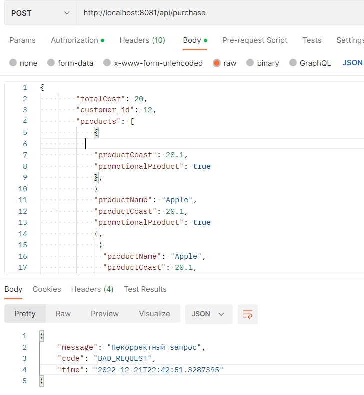
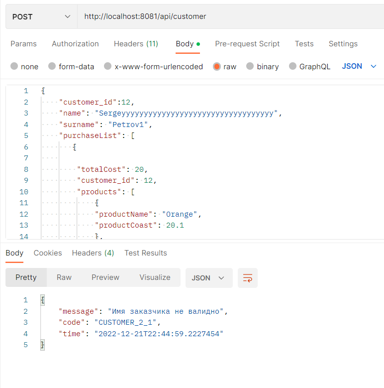
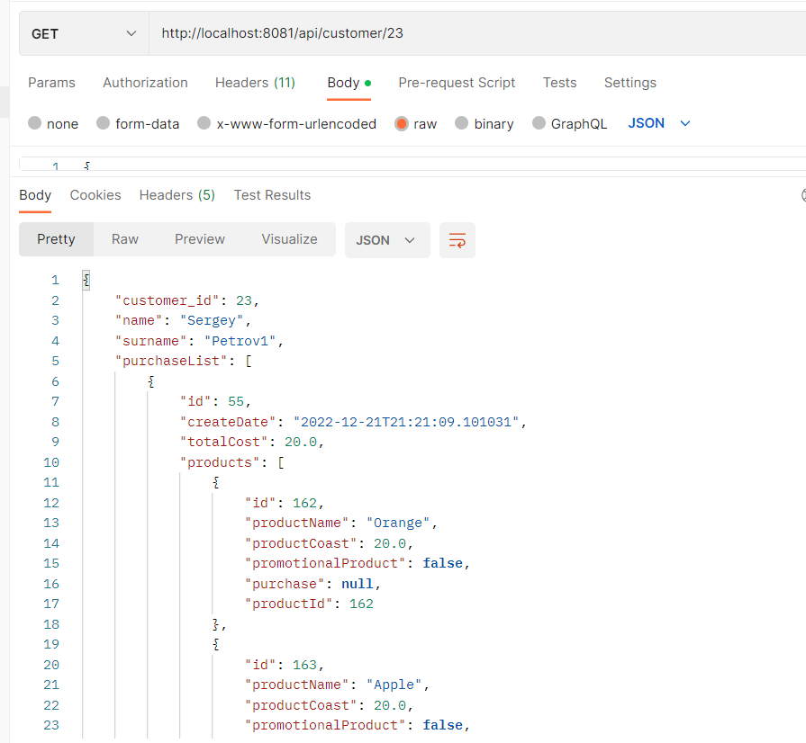
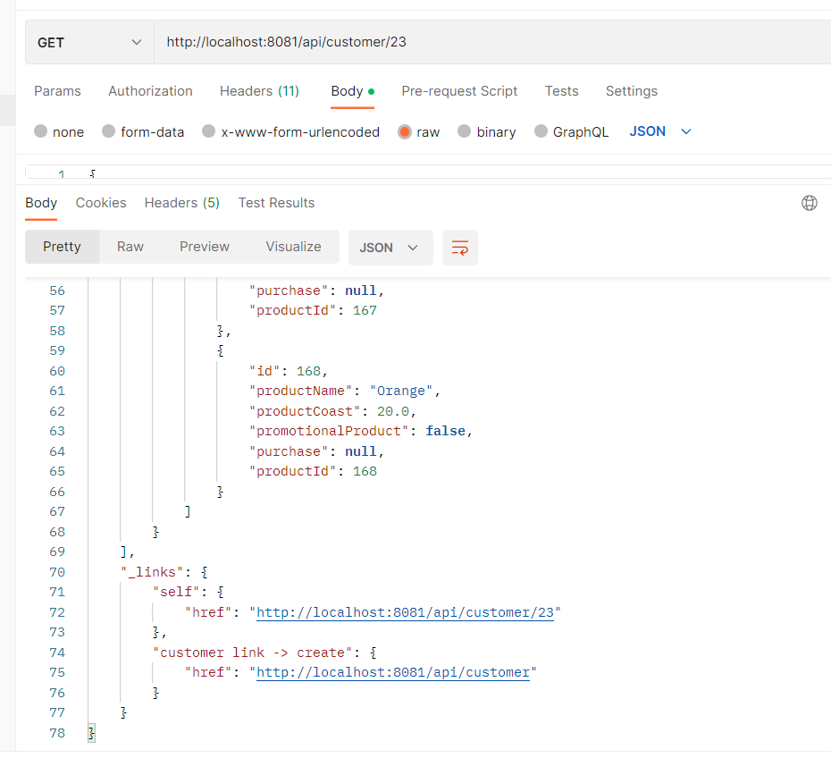

#Приложение "Интернет магазин"
Данное приложение состоит из трех слоев: DAO, Service, Controller.
###1. Взаимодействие с базой данных postgresql.
Взаимодействие с базой данных реализовано при помощи Spring Data. В виду того, что приложение является простым
интернет магазином, принято решение наследовать интерфейсы для взаимодействия с базой данных от
CrudRepository, предоставляющим реализацию простых CRUD операций. 
В файле application.properties заданы настройки для соединения с соответствующей базой данных.
###2. Сервисный слой 
Сервисный слой представляет собой несколько групп классов (services, mappers, validators, dto).
Services представляет собой слой для взаимодействия между Repository и Controller. Через сервисный
слой вызываются методы из Repository.
В виду того, что сущности могут содержать в себе другие сущности (прим. Customer содержит в себе
Purchase и Product) имеет смысл реализовать паттерн DTO. А для того, что переводить сущность из состояния
DTO к обычному и обратно - реализован Mapper. Кроме того в Mapper проводится проверка количества
купленных акционных товаров, для возврата корректной цены.
Validators представляют собой два простых валидатора, для проверки корректности введенных данных
(прим. Имя и Фамилия кастомера должны быть не больше определенного количества букв - иначе эксепшен)
###3. Эксепшены
В данном приложении реализовано несколько кастомных эксепшенов (энтити не найден, ошибка валидации, BAD REQUEST).
За работу с исключениями отвечает 4 класса (ErrorCode - Enum в котором перечислены эксепшены,
CustomErrorResponse - класс для определения внешнего вида выбрашенного исключения, AppException -
непосредственно сам класс для исключения, и GlobalExceptionHandler - класс для глобальной обработки
исключений в рамках программы). Кроме того, в каталоге ресурсы имеются несколько файлов, содержащими
различные языковые варианты для исключений.
Например, в случае если не указать имя продукта, мы получает BAD_REQUEST.

Если имя пользователя будет слишком большим - получим исключение CUSTOMER_2_1

и т.д.
###4. Entities
Энтити классы содержат в себе аннотации Entity, Id, определяют стратегию генерации id, и содержат
аннотации для соединения таблиц в базе данных и типы связей.
###5. Controllers
В контроллерах описаны маппинги для методов, а также генерируются ссылки для HAOTEAOS (при помощи 
наследования RepresentationModel)

